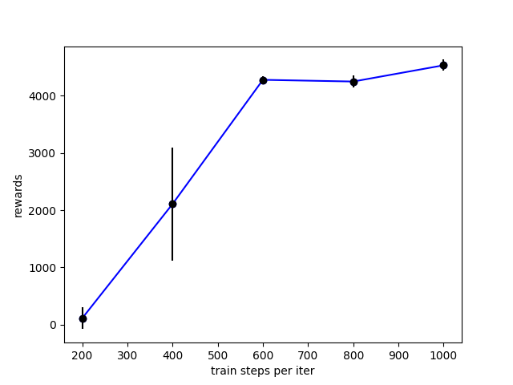
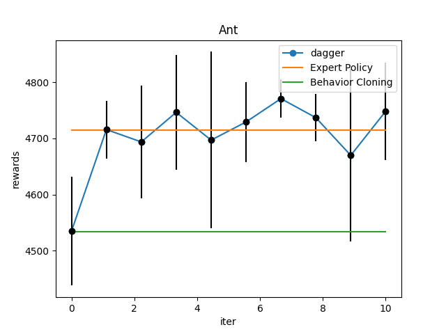
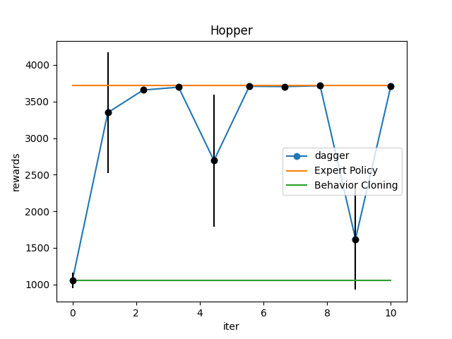

# Task 3.1
| Task | Expert Reward | My Policy's Reward |
|------|------|----|
| Ant | $4681\pm 30$ | $4534\pm 96$ |
| Hopper | $3717.5\pm 0.3$ | $1056\pm 103$ |

The other parameters are:
| Parameter | Value| 
|------|------|
| ep_len | 1000 |
| batch_size | 1000 |
| eval_batch_size | 5000 |
| train_batch_size | 100| 
| n_layers | 2|
| size | 64 |

*Side Note.* The value of `Expert Reward` is taken to be the training reward, since we may assume the agent can totally mimic the expert in training steps. We can also directly calculate the expert reward, and the result is similar. (The code of that is already deleted for simplicity.)

# Task 3.2

I choose training steps (`num_agent_train_steps_per_iter`) for the hyperparameter. The reason I choose it is that it is the most direct parameter that can affect the training process.

| Training Steps | Reward | 
|------|------|
| 1000 | $4534\pm 97$ |
| 800 | $4250\pm 109$ |
| 600 | $4280\pm 67$ | 
| 400 | $2109\pm 990$ |
| 200 | $111\pm 191$ |

# Task 4.2

Here are the experiement result carried on Ant and Hopper environment, respectively. The parameters to report are listed below:

| Parameter | Value| 
|------|------|
| ep_len | 1000 |
| batch_size | 1000 |
| eval_batch_size | 5000 |
| train_batch_size | 100| 
| n_layers | 2|
| size | 64 |
| num_agent_train_steps_per_iter | 1000 |

