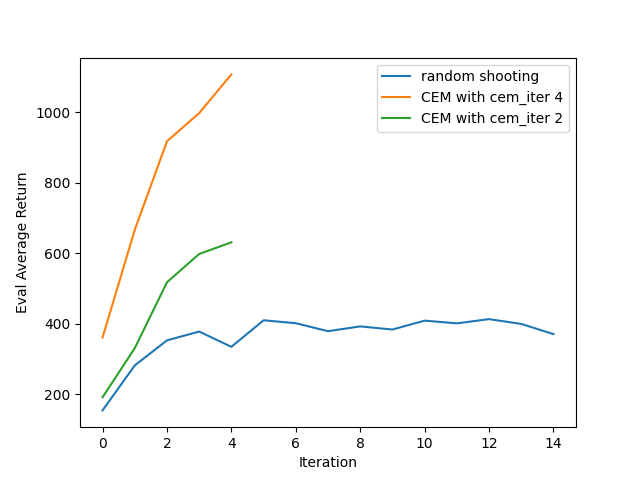

# Notice

1. As I discussed in [my_experiment](./my_experiment_log/my_experiment.md), I tried a own method to run. I think that it should work well, but actually it don't. Analysis in detail is hence shown below.

2. Unfortunately, as there are bugs in my auto-orgainze file program, I have lost some training logs (in `run_log` dir). 

# Problem 1

Initial run learning curve:

Hyperparameter 1: `num_layers` from 1 to 2

Hyperparameter 2: `hidden_size` from 32 to 64

# Problem 2

Average eval return: -46.2067

With my method, the avg return is around -31.3087. However, there is a great variance, so the result isn't promising.

# Problem 3

## Obstacle environment

## Reacher environment

## HalfCheetah environment

Notice that in these three figures, I also show my own method here. I think that in average, my method performs similarly as the original method. I still don't know why.

# Problem 4

## Effects of Ensemble Size

From the image, we can see that the ensemble size does not have a significant effect on the performance of the model after enough iterations. However, at the beginning, it is clear that the larger the ensemble size, the bigger the reward. This means that the sampling method do work here.

Below is my own method with the same setting. We can see that initially our method is better, but finally it is less effective. Moreover, it can be seen that the ensemble size don't matter much even at the beginning given the usage of our method. This means that our method **can** kind of "eliminate" the bias of the models.

## Effects of Number of Action Samples

It is somewhat evident that the more the number of action samples, the better the performance of the model. The reason may be: for the random shooting method, the more the number of action samples, the more likely it is to find the optimal action.

## Effects of Planning Horizon

The only part which is clear is that, the final performance increase as the horizon decreases. This is because the environment is relatively simple, so there is no need for long-horizon planning. Thus, a long horizon only harms the performance due to the error accumulation.

# Problem 5

The comparation figure is shown below.

It can be seen that CEM significantly outperforms random shooting all the way. With less `cem_iter`, CEM is just like random shooting, so it is worse.

Below is a comparation of our method and the original method. I can't comment much.

# Problem 6

The code isn't finished yet. I have to finish it after I finish hw3.

# Afterward Notes

I originally made a serious mistake: I used to normalize `ac` but not `ob` since I am confused by the variable name `obs_acs_std` (and `obs_delta_std`). The correct solution is concat `ac` with `ob` then normalize.